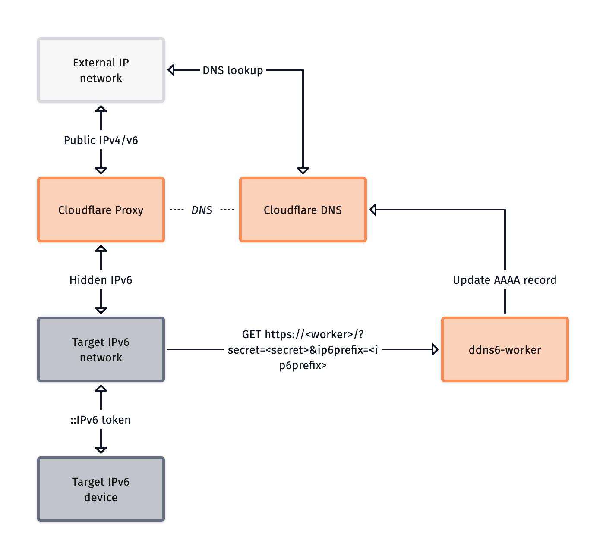

# ddns6-worker 

ddns6-worker is a DynDNS service to update your IPv6 IP adress on Cloudflare hosted domains. It uses the Cloudlfare API to update the dns record.

[](https://deploy.workers.cloudflare.com/?url=https://github.com/skuncel/ddns6-worker)

## Wrangler

Wrangler is used to develop, deploy, and configure your Worker via CLI.

Further documentation for Wrangler can be found [here](https://developers.cloudflare.com/workers/tooling/wrangler).

## Usage

The `src/lib.rs` file acting as an entrypoint for requests hitting the DynDNS worker.

With `wrangler`, you can build, test, and deploy your Worker with the following commands:

```sh
# run your Worker in an ideal development workflow (with a local server, file watcher & more)
$ wrangler dev --local

# deploy your Worker globally to the Cloudflare network (update your wrangler.toml file for configuration)
$ wrangler deploy
```

Read the latest `worker` crate documentation here: https://docs.rs/worker

## Configuration
### Worker
There are some configuration variables, regarding authentication.
> [!CAUTION]
> The following two variables should be defined as secrets, as they are sensible.

```properties
CLOUDFLARE_API_KEY=<your-api-key>
DDNS_SECRET=<your-selfdefined-secret>
```

The remaining configuration variables are belong to configuration of dns record.
```properties
CLOUDFLARE_ZONE_ID=<your-dns-zone-id>
CLOUDLFARE_RECORD_ID=<your-dns-record-id>
DDNS_IP6_TOKEN=<your-ip6-token-to-expose>
```
### Client
On IP change, the client have to send an request to the worker endpoint with the necessary parameters.
A request looks like the following:
```http
GET /?secret=<secret>&ip6prefix=<ip6prefix> HTTP/1.1
Host: <worker>
```
The parameter have to been set as follows:
```properties
secret=<your-worker-side-configured-secret>
ip6prefix=<ip6-prefix-of-the-target-network>
```
